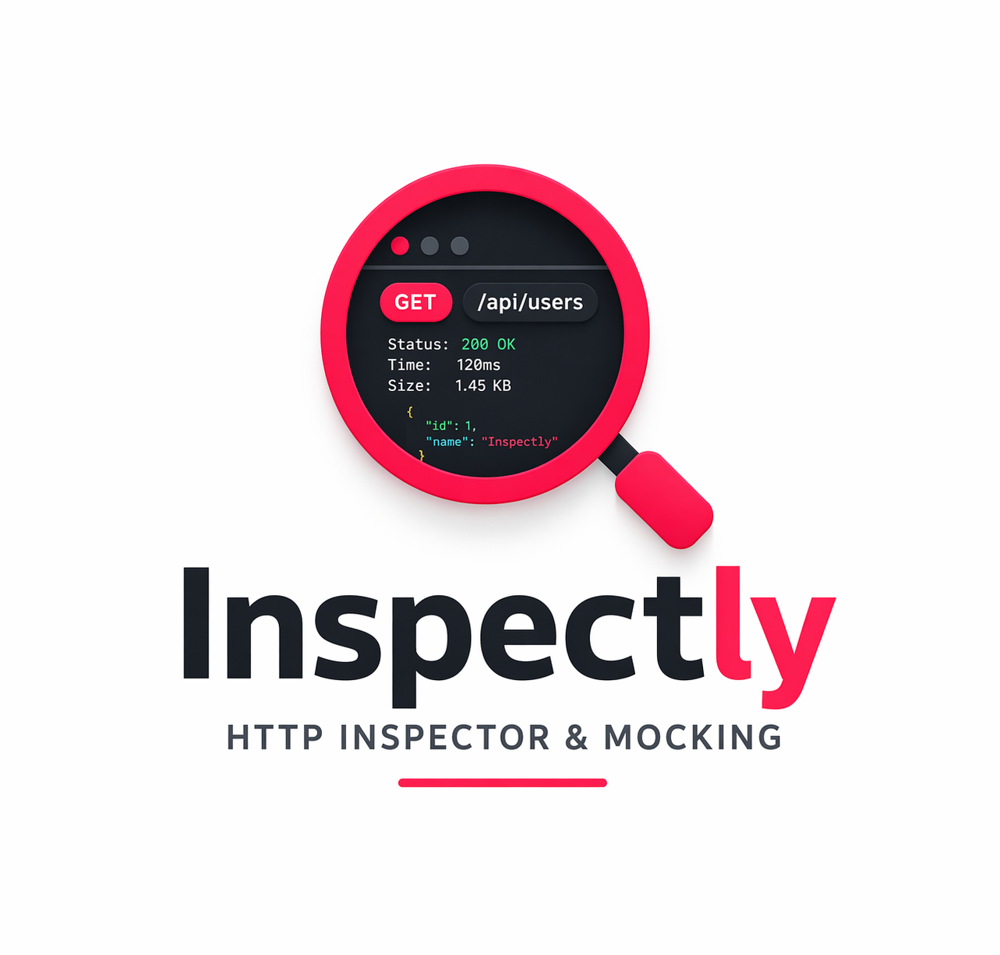
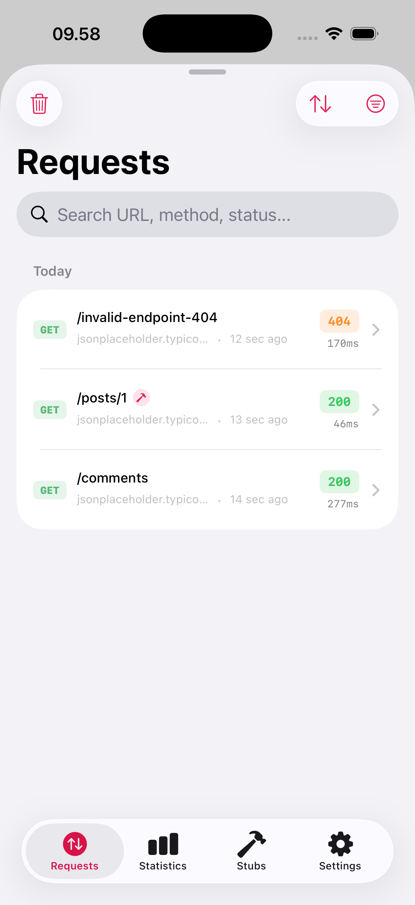
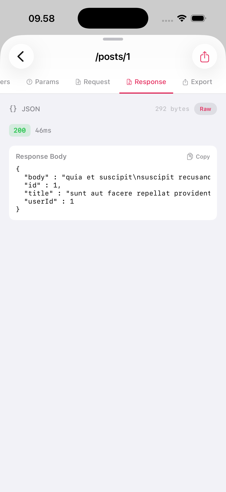
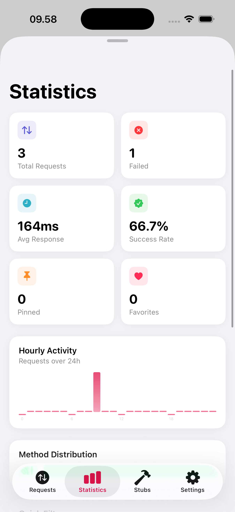
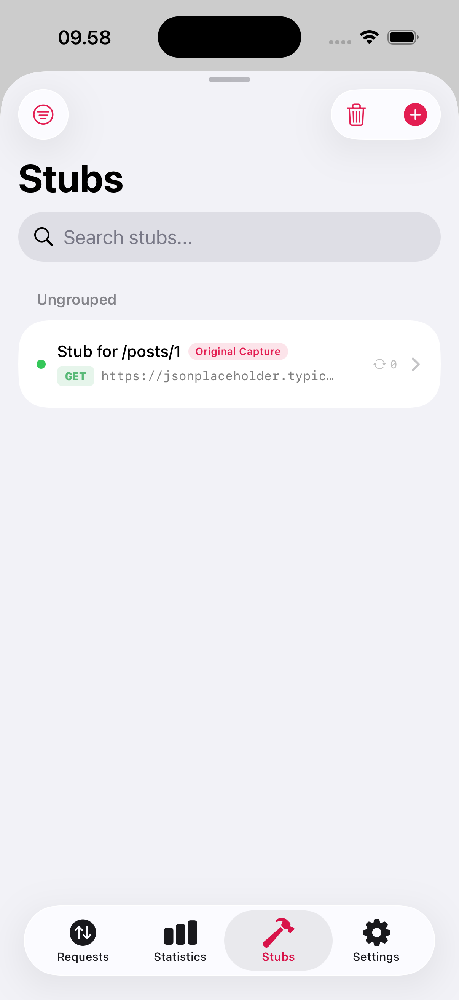
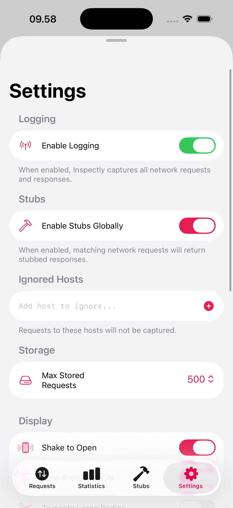

# Inspectly

<p align="center">
  
</p>

<p align="center">
  <strong>Developer-first HTTP interception and mocking for iOS.</strong>
</p>

<p align="center">
  Capture, inspect, debug, and mock network requests with zero configuration and zero dependencies.
</p>

<p align="center">
  
  
  
  
</p>

---

Inspectly is a lightweight HTTP inspector and API stubbing toolkit for iOS.

It automatically captures network traffic, provides a beautiful in-app inspector, and allows you to create and manage mocked API responses directly from live requests.

Built on top of the Foundation networking stack, Inspectly works seamlessly with `URLSession`, Alamofire, AFNetworking, and any networking layer powered by Foundation.

## Features

- Automatic request interception with zero setup
- Zero external dependencies
- In-app inspector UI for Requests, Statistics, Stubs, and Settings
- Request and response inspection including headers, bodies, timing, and metadata
- Create API stubs directly from captured requests
- Enable, disable, duplicate, search, and manage stubs
- Search, filter, sort, favorite, pin, and clear captured requests
- Export logs and stubs directly from the app
- Shake gesture shortcut to quickly open the inspector

---

## Requirements

- iOS 13.0+
- Swift 5.9+
- Xcode 15+

> Note: Core request interception and storage work on iOS 13+. The built-in inspector interface requires iOS 16+.

---

## Installation

### Swift Package Manager

```swift
dependencies: [
    .package(url: "https://github.com/balitax/Inspectly.git", from: "1.0.4")
]
```

Then add `Inspectly` to your target dependencies.

---

## Quick Start

### Enable Inspectly

```swift
import Inspectly

@main
struct MyApp: App {
    init() {
        Inspectly.enable()
    }

    var body: some Scene {
        WindowGroup {
            ContentView()
        }
    }
}
```

### Open the Inspector Manually

```swift
Inspectly.presentInspector()
```

### Recommended Debug-Only Setup

```swift
import Inspectly

@main
struct MyApp: App {
    init() {
        #if DEBUG
        Inspectly.enable()
        #endif
    }

    var body: some Scene {
        WindowGroup {
            ContentView()
        }
    }
}
```

---

## Configuration

```swift
import Inspectly

let configuration = Inspectly.Configuration(
    isLoggingEnabled: true,
    isStubEnabled: true,
    ignoredHosts: ["example.com"],
    isShakeGestureEnabled: true,
    ignoreLocalhost: true
)

Inspectly.enable(with: configuration)
```

### Available Configuration

| Option | Description |
| --- | --- |
| `isLoggingEnabled` | Enable or disable request capture |
| `isStubEnabled` | Enable or disable request stubbing globally |
| `ignoredHosts` | Ignore selected hosts from being captured |
| `isShakeGestureEnabled` | Open the inspector by shaking the device |
| `ignoreLocalhost` | Ignore `localhost` and `127.0.0.1` |
| `stubRepository` | Provide a custom stub repository |

### Public APIs

- `Inspectly.enable(isEnabled:with:)`
- `Inspectly.disable()`
- `Inspectly.presentInspector(rootView:)`
- `Inspectly.isEnabled`
- `Inspectly.container`

---

## Compatibility

Inspectly works with:

- `URLSession`
- Alamofire
- AFNetworking
- Any networking library built on top of Foundation

No custom interceptor setup is required for common use cases.

---

## Screenshots

| Requests | Request Detail | Statistics | Stubs | Settings |
| --- | --- | --- | --- | --- |
|  |  |  |  |  |
---

## Typical Workflow

1. Enable Inspectly in your app
2. Trigger real API calls
3. Open the inspector using shake gesture or `Inspectly.presentInspector()`
4. Browse captured requests
5. Create a stub from an existing request
6. Adjust the mocked response in the Stubs tab
7. Re-run the flow with stubs enabled

---

## Contributing

Contributions are always welcome.

If you would like to improve the UI, add new features, improve performance, or fix bugs, feel free to open an issue or submit a pull request.

---

## License

Inspectly is available under the MIT license. See [LICENSE](LICENSE) for more information.

---

<p align="center">
  Made with ❤️ by <a href="https://github.com/balitax">Agus Cahyono</a>
</p>
