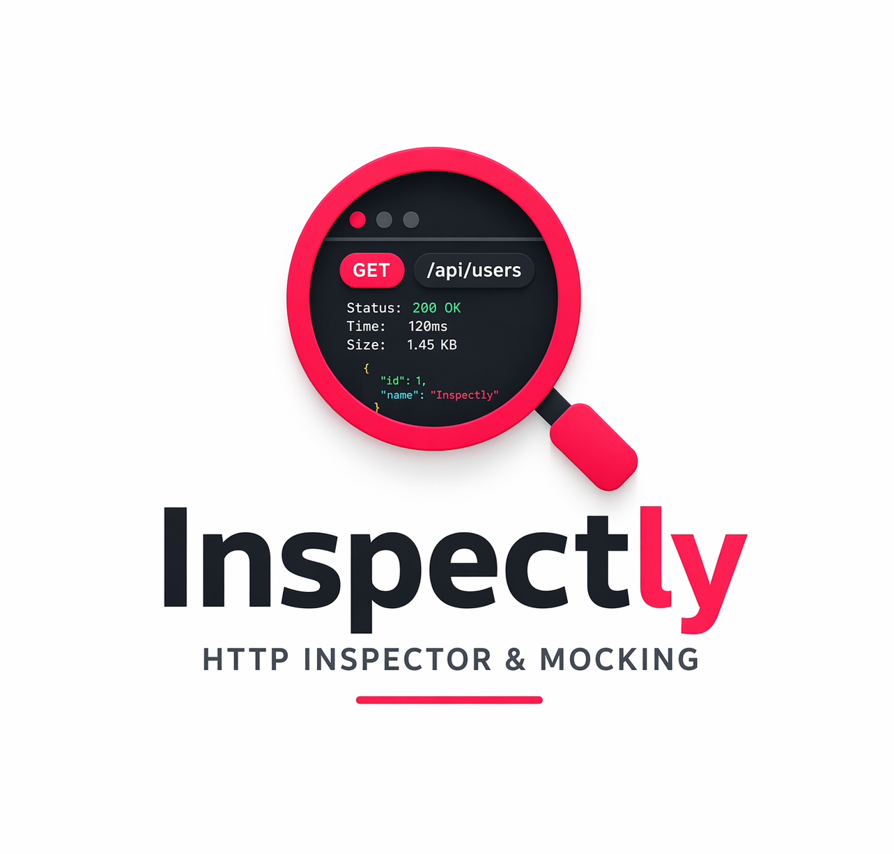
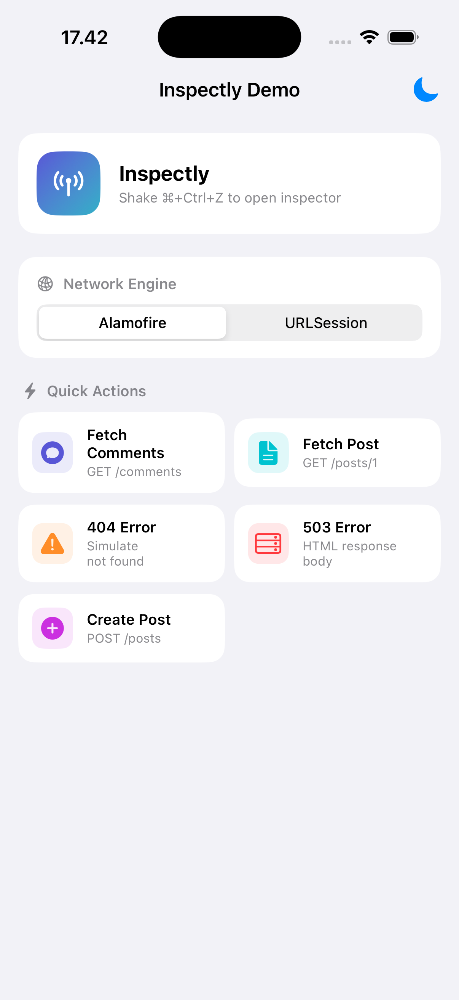
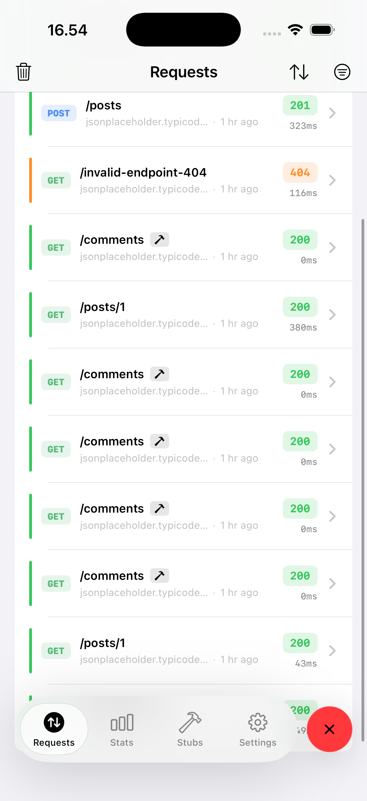
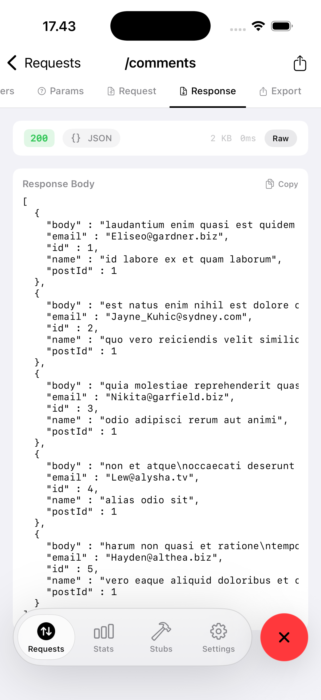
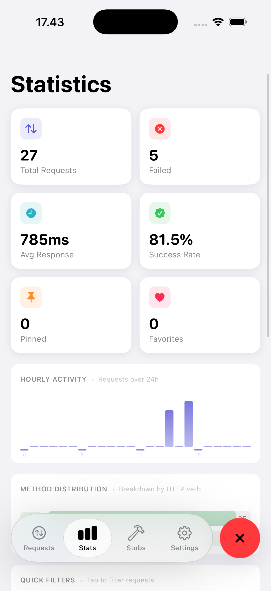
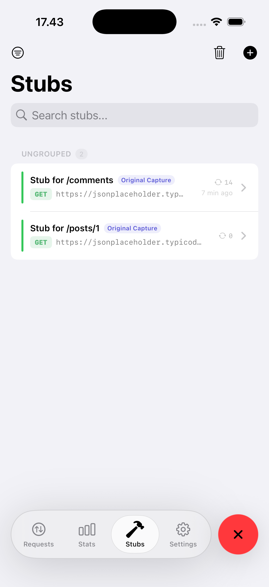
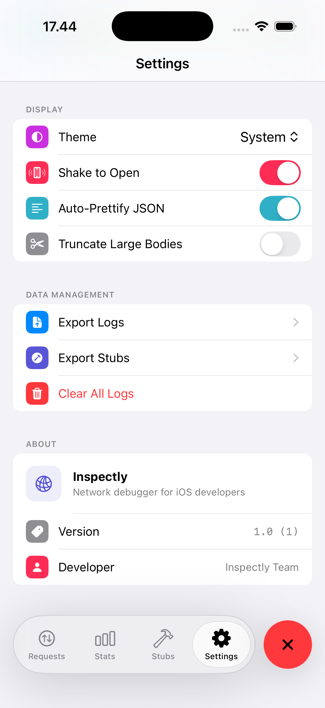

# Inspectly

<p align="center">
  
</p>

<p align="center">
  <strong>Developer-first HTTP interception and mocking for iOS.</strong>
</p>

<p align="center">
  Capture, inspect, debug, and mock network requests with zero configuration and zero dependencies.
</p>

<p align="center">
  
  
  
  
  
</p>

---

Inspectly is a lightweight HTTP inspector and API stubbing toolkit for iOS.

It automatically captures network traffic, provides a beautiful in-app inspector, and allows you to create and manage mocked API responses directly from live requests.

Built on top of the Foundation networking stack, Inspectly works seamlessly with `URLSession`, Alamofire, AFNetworking, and any networking layer powered by Foundation.

## Features

### Capture & Inspect
- Automatic request interception with zero setup
- Zero external dependencies
- In-app inspector UI for Requests, Statistics, Stubs, and Settings
- Request and response inspection including headers, bodies, timing, and metadata
- **Rich HTML Rendering** — interactive preview for HTML responses
- **Smart Content Detection** — automatic content-type sniffing when server headers are misleading
- **Sensitive Header Masking** — `Authorization`, `Cookie`, `X-Api-Key` and other sensitive headers are hidden by default with a per-header reveal toggle
### Request Management
- Search, filter, sort, favorite, pin, and tag captured requests
- Paginated request list with auto-load-more
- Export logs as JSON directly from the app

### API Stubbing
- Create stubs directly from any captured request in one tap
- **Flexible URL Matching** — match stubs by `Exact`, `Contains`, `Prefix`, `Suffix`, or `Regex` URL pattern
- All requests with matching URLs are automatically marked as stubbed
- Enable, disable, duplicate, group, and manage stubs
- Export stubs as JSON for sharing or version control

### Performance & Debugging
- **Slow Request Detection** — configurable threshold highlights slow requests with visual indicator
- **Network Throttling** — simulate Edge, 3G, LTE, or custom bandwidth/delay conditions
- **Performance Heatmap** — top 5 slowest endpoints with color-coded average response time bars
- **Duplicate Detector** — surfaces endpoints called multiple times with a repeat count badge
- **Large Response Warning** — flags responses over 1 MB in Statistics and the request list
- Timeline view for DNS, connect, TLS, TTFB, and transfer phases
- cURL export with correct shell escaping for all requests

### Search
- **Response Body Search** — full-text search inside JSON/plain-text responses with next/prev highlight navigation
- **Full-Text Search** — search across URL, method, host, status code, request body, response body, and error messages

### Settings
- Configure max stored requests (100–2500)
- Ignore specific hosts from being captured
- Light / Dark / System theme override
- Auto-prettify JSON responses

---

## Requirements

- iOS 16.0+
- Swift 5.9+
- Xcode 15+

---

## Installation

### Swift Package Manager

```swift
dependencies: [
    .package(url: "https://github.com/balitax/Inspectly.git", from: "1.3.0")
]
```

Then add `Inspectly` to your target dependencies.

---

## Quick Start

### Enable Inspectly

```swift
import Inspectly

@main
struct MyApp: App {
    init() {
        Inspectly.enable()
    }

    var body: some Scene {
        WindowGroup {
            ContentView()
        }
    }
}
```

### Open the Inspector Manually

```swift
Inspectly.presentInspector()
```

### Recommended Debug-Only Setup

```swift
import Inspectly

@main
struct MyApp: App {
    init() {
        #if DEBUG
        Inspectly.enable()
        #endif
    }

    var body: some Scene {
        WindowGroup {
            ContentView()
        }
    }
}
```

---

## Configuration

```swift
import Inspectly

let configuration = Inspectly.Configuration(
    isLoggingEnabled: true,
    isStubEnabled: true,
    ignoredHosts: ["example.com"],
    isShakeGestureEnabled: true,
    ignoreLocalhost: true
)

Inspectly.enable(with: configuration)
```

### Available Configuration

| Option | Type | Default | Description |
| --- | --- | --- | --- |
| `isLoggingEnabled` | `Bool` | `true` | Enable or disable request capture |
| `isStubEnabled` | `Bool` | `true` | Enable or disable request stubbing globally |
| `networkThrottlingPreset` | `NetworkThrottlingPreset` | `.off` | Simulate network conditions (Edge, 3G, LTE, Custom) |
| `slowRequestThreshold` | `TimeInterval` | `1.0` | Duration (seconds) above which requests are flagged as slow |
| `maxStoredRequests` | `Int` | `500` | Maximum number of requests retained in storage |
| `ignoredHosts` | `[String]` | `[]` | Hosts to exclude from capture |
| `isShakeGestureEnabled` | `Bool` | `true` | Open the inspector by shaking the device |
| `ignoreLocalhost` | `Bool` | `false` | Ignore `localhost` and `127.0.0.1` |
| `stubRepository` | `StubRepositoryProtocol?` | `nil` | Provide a custom stub repository |

### Public APIs

- `Inspectly.enable(isEnabled:with:)`
- `Inspectly.disable()`
- `Inspectly.presentInspector(rootView:)`
- `Inspectly.isEnabled`
- `Inspectly.container`

---

## Compatibility

Inspectly works with:

- `URLSession`
- Alamofire
- AFNetworking
- Any networking library built on top of Foundation

No custom interceptor setup is required for common use cases.

---

## Screenshots

| Demo App | Requests | Request Detail |
| --- | --- | --- |
|  |  |  |

| Statistics | Stubs | Settings |
| --- | --- | --- |
|  |  |  |

---

## Typical Workflow

1. Enable Inspectly in your app
2. Trigger real API calls
3. Open the inspector using `Inspectly.presentInspector()` or shake gesture (if enabled via configuration)
4. Browse captured requests
5. Create a stub from an existing request
6. Adjust the mocked response in the Stubs tab
7. Re-run the flow with stubs enabled

---

## Changelog

### [1.3.0] — 2026-06-12
- **Performance Heatmap** — top 5 slowest endpoints visualized as color-coded bars (green < 500ms, orange < 2s, red ≥ 2s)
- **Duplicate Detector** — groups requests by method + URL and surfaces repeated calls with a count badge
- **Large Response Warning** — responses over 1 MB are flagged in the Statistics view and marked with a warning indicator in the request list
- **Response Body Search** — full-text search inside JSON and plain-text responses with next/prev highlight navigation and a fixed search bar
- Floating tab bar now hides automatically when entering Request Detail
- Dismiss tab added to the floating tab bar for quick close
- Fixed next/prev highlight scroll in response body search
- Settings: removed Shake to Open toggle from UI (still configurable via `Inspectly.Configuration`)

### [1.2.0] — 2026-05-08
- **iOS 16.0 minimum** — dropped iOS 13–15 support
- Liquid glass-inspired floating tab bar for iOS 16–25
- Inspector now presents fullscreen
- Revamped DemoApp with card layout and response console
- Fixed dark mode statistics cards visibility
- Converted `StorageManager` to `actor` (eliminates Sendable warnings)
- Removed all redundant `@available` annotations

### [1.1.0] — 2026-05-01
- Flexible stub URL matching: Exact, Contains, Prefix, Suffix, Regex
- Batch-mark all matching URL requests as stubbed when a stub is saved
- Clearing all requests now also clears all stubs
- Configurable slow request detection threshold (Settings → Performance)
- Search covers response body, request body, and error messages
- Sensitive header masking with per-header reveal toggle
- Paginated request list with auto-load-more
- Configurable max stored requests (100–2500)
- cURL export with correct shell escaping
- Full UI revamp: Request Detail, Request List, Statistics, Stubs, Settings

### [1.0.0] — 2026-04-19
- Initial release

---

## Contributing

Contributions are always welcome.

If you would like to improve the UI, add new features, improve performance, or fix bugs, feel free to open an issue or submit a pull request.

---

## License

Inspectly is available under the MIT license. See [LICENSE](LICENSE) for more information.

---

<p align="center">
  Made with ❤️ by <a href="https://github.com/balitax">Agus Cahyono</a>
</p>
